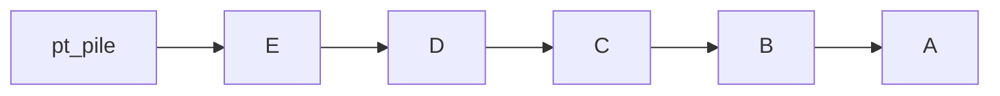
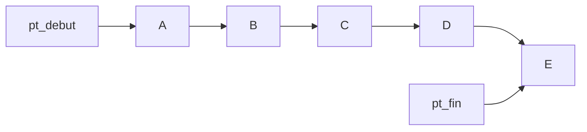
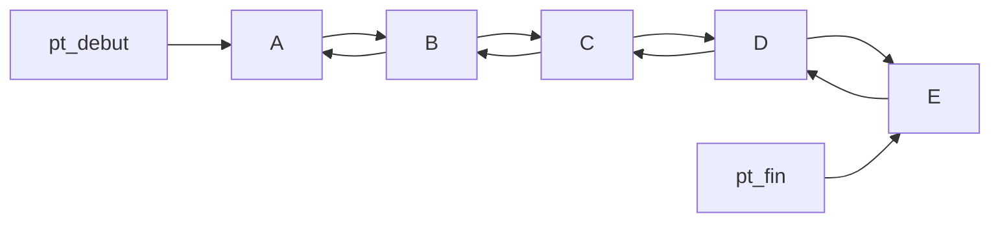
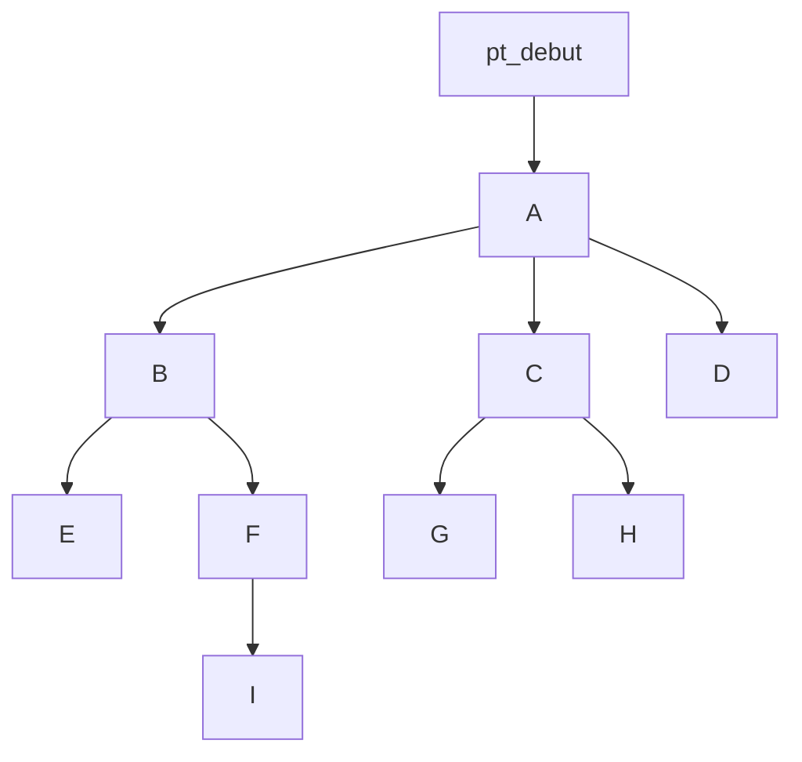
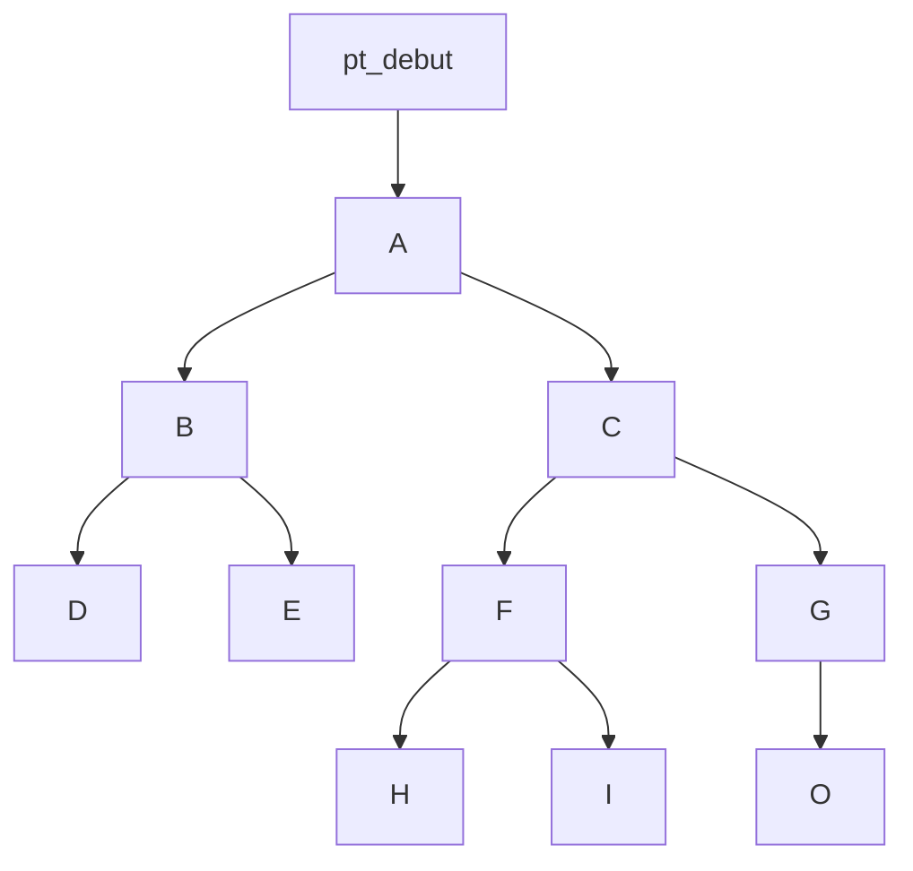

# Leçon C 20
## Les structures de données

[**Les tableaux**](https://fr.wikipedia.org/wiki/Tableau_(structure_de_données))

[**Les Piles (Stack)**](https://fr.wikipedia.org/wiki/Pile_(informatique))
LIFO: Last In First Out

Exemple 
* de  domaine d'utilisation: 
	* Compilation
	* Ordonnanceur avec Stratégie LIFO
	* ...
* d'algorithme sur les piles:
	* push (ajout d'un élément en dernière position)
	* pop (suppression du dernier element ajouté)
	* ....

[**Les Files (Queue) à sens unique**](https://fr.wikipedia.org/wiki/File_(structure_de_données))

FIFO: First In First Out

Exemple 
* de  domaine d'utilisation: 
	* Ordonnanceur avec Stratégie FIFO
	* ...
* d'algorithme sur les files:
	* enqueue( ajout d'un élément en dernière position)
	* dequeue (suppression du premier element ajouté)
	* ....

**Les Files (Queue) à double sens **

**Les arbres (Trees)**

Exemple 
* de  domaine d'utilisation: 
	* Répresentation des Fichier
	* ...

[**Les arbres binaires (Binary Trees )**](https://fr.wikipedia.org/wiki/Arbre_binaire)

Exemple 
* de  domaine d'utilisation: 
	* Recherche opérationnelle
	* ...
* d'algorithme sur les arbres binaires:
	* parcours prefixés
	* parcours infixés
	* parcours prefixés
	* ....

[**Les graphes (graphs)**](https://fr.wikipedia.org/wiki/Théorie_des_graphes)
Il existe
* Les graphes orientés
* Les graphes non-orientés

exemple 
* de  domaine d'utilisation: 
	* réseau routier (maps)
	* réseau internet
	* ...
* d'algorithme sur les graphes:
	* [postier chinois](https://fr.wikipedia.org/wiki/Problème_du_postier_chinois), 
	* parcours Euleriens
	* ....

### Type d'objet
possibilité de créer plusieurs elements du Type en question.

### Objet.
Possibilité de créer un seul objet du type defini.
