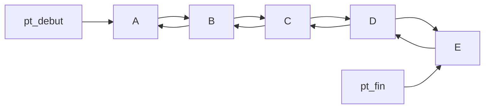

# Leçon C 24
## Les structures de données: Les Listes doublement chainées (DList)

Exemple 
* de  domaine d'utilisation: 
	* Mathématiques appliquées
	* ...
* d'algorithme sur les  dlist:
	* chaines de Markov
	* machine à état fini
	* ....
## Lab 5: 
Réalisation d'une D-liste chainés de réel.
Implementer les opérations de 
* créer d'une liste vide
* savoir si la liste est vide ou non
* ajouter un élément au debut
*  ajouter un élément à la fin
*  supprimer l'élément au debut
*  supprimer l'élément à la fin
* d'afficher les éléments de la file (2versions)
* récupérer le premier/ le dernier element de la liste
* le nombre d'éléments de la liste
* recherche d'un element (2)
* tester les operations ci-haut sur deux files .