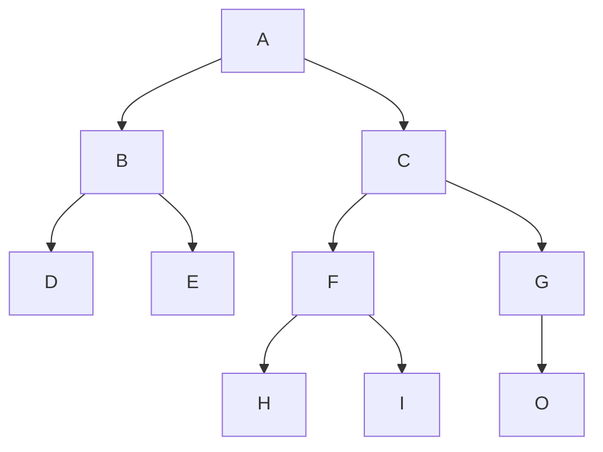

# Leçon C 25
## [Les structures de données: Les arbres binaires (Binary Trees )](https://fr.wikipedia.org/wiki/Arbre_binaire)

Exemple 
* de  domaine d'utilisation: 
	* Recherche opérationnelle
	* ...
* d'algorithme sur les arbres binaires:
	* parcours prefixés
	* parcours infixés
	* parcours prefixés
	* ....

## Lab 6: 
Réalisation d'une arbre binaire de caractère.
Implementer les opérations de faire la
* création d'un arbre
* si un arbre est une feuille ou non
* jonction de deux arbres
* parcours prefixés
* parcours infixés
* parcours prefixés
* nombre Noeud de l'arbre