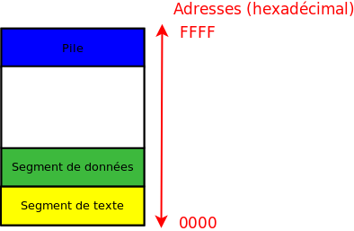

# Leçon C 36
## Les processus

### Parallélisme et pseudo-parallélisme
Le **Parrellisme**: La machine execute les taches en même temps(parallèle). 
Le **pseudo-parallélisme**: L'ordonnanceur donne quelques milliseconde aux taches dans la liste d'attente. Ce qui donne l'impression qu'ils sont exécutés en parallèle. 
Les processus sont la base du pseudo-parallélisme
### processus vs programme

processus en cours d'execution
programme écrit dans un langage

### Espace d’adressage des processus

Chaque processus possède un  **espace d'adressage**, c'est-à-dire un ensemble d'adresses mémoires dans lesquelles il peut lire et écrire.  
Cet espace est divisé en trois parties :
* Le  **segment de texte**  (le code du programme) ;
* Le  **segment de données**  (les variables) ;
* La  **pile**.



### PID, PPID, UID, GID
PID: Process Identifier
PPID: Parent Process Identifier
UID: User Identifier
GID: Group Identifier

### hierarchie des processus
pere et fils etc ...
* le premier processus est appelé **System idle process** il a pour pid 0.
* son fils est le programme **init** il a pour pid 1.
* le processus meurt ou engendre un fils

### état des processus
-   **en cours d'exécution ( R )**
-   **endormi  ( S )**
-   **arrêté (T)** 
-   **zombie ( Z )** 

L'OS utilise le tableau de structure (table des processus) pour implementer un processus.

```c
#include <unistd.h>
#include <sys/types.h>
```

```c
/*
retourne le pid du processus courant
*/
pid_t getpid(void);

/*
retourne le pid du processus parent 
*/
pid_t getppid(void);

/*
retourne le UID du processus courant
*/
uid_t getuid(void);
/*
retourne le GID du processus courant
*/
gid_t getgid(void);

/*
crée un processus fils 
*/
pid_t fork(void);
```
pour endormir le processus parent le temps que son fils fini d'executer
```c
#include <sys/wait.h>
pid_t wait(int *status);
pid_t waitpid(pid_t pid, int *status, int options);
```
pour terminer un processus
``` c
#include <stdlib.h>

void exit(status);
/*
quitter brusquement: de façon anormale
*/
void abort(void);

```

